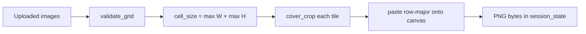

# MosaicMaker

[](https://github.com/RajeshTharyan/MosaicMaker/actions/workflows/tests.yml)
[](LICENSE)
[](https://codespaces.new/RajeshTharyan/MosaicMaker?quickstart=1)
[](https://share.streamlit.io/deploy)

A small Streamlit app that cover-crops a batch of uploads into one uniform PNG grid.

There is **no public hosted demo**. The Streamlit badge above opens Streamlit Cloud’s deploy flow for a copy of this repo; it is not a live instance.

---

## The problem

Putting several figures on one slide or one manuscript panel is usually a manual job: paste into PowerPoint or a raster editor, eyeball alignment, crop leftovers, export. That is slow, and the cells rarely share a true common size.

This repo is a browser tool for that job only. You pick rows and columns, it scales each image to **cover** a shared cell (max width × max height among the batch), centre-crops the overflow, and writes one PNG. It is **not** a photographic mosaic: tiles are not chosen to approximate a target picture.

---

## What a visitor should infer

This is a teaching/research utility, not a product. The interesting part is how the work is split and tested.

| If you care about… | Look here | What it shows |
| --- | --- | --- |
| Problem framing | This README, `mosaic/grid.py` docstring | A narrow, honest scope (grid compositor, not photomosaic / collage editor) |
| PIL / geometry | `mosaic/grid.py` — `cell_size`, `cover_crop`, `compose_mosaic` | Cover-crop (scale-to-fill + centre crop) instead of letterboxing; row-major paste |
| Structure | `streamlit_mosaic.py` vs `mosaic/` | UI is a thin client; composition is importable without Streamlit |
| Streamlit patterns | `streamlit_mosaic.py` session state | Mosaic PNG is stored so **Download** survives a rerun; stale output is cleared when files or grid change |
| Tests you can run in CI | `tests/test_grid.py` | Grid capacity, cell size, layout, leftover cells, PNG round-trip — no GUI, no network |
| How someone else runs it | `.devcontainer/`, `requirements.txt`, `.github/workflows/tests.yml` | Codespaces one-click, pinned runtime deps, pytest on pull requests |

What this repo does **not** demonstrate: tile-to-photo matching, colour management, drag-and-drop reorder, or a production file pipeline.

---

## Architecture

```
streamlit_mosaic.py     # upload, grid controls, preview, download
        │
        ▼
mosaic/grid.py          # validate_grid, cell_size, cover_crop, compose_mosaic, stats
        │
        ▼
tests/test_grid.py      # the same functions, with synthetic RGB images
```



Design choices that are intentional:

- **Cell size is the batch maximum**, not a user-entered pixel size. Mixed aspect ratios still share one cell; extra pixels on the long side are cropped.
- **Empty cells stay white** when the grid is larger than the upload count. The grid must not be *smaller* than the upload count.
- **No disk writes.** Images stay in memory for the Streamlit session.
- **Core does not import Streamlit**, so pytest can exercise geometry on a CI runner.

---

## Using the app in the browser

After the app is running (local, Codespaces, or your own Streamlit Cloud deploy):

1. Upload one or more PNG / JPEG / BMP / TIFF files. Thumbnails appear in upload order — that order is the mosaic order.
2. Set **Rows** and **Columns**. The product must be ≥ the number of files (the UI blocks **Create Mosaic** otherwise).
3. Click **Create Mosaic**. The preview is full container width. A caption reports canvas size, cell size, and unused cells.
4. **Download PNG** writes `mosaic.png`. Changing the files or the grid clears the previous result so you cannot download a stale canvas.

In GitHub Codespaces the Dev Container starts Streamlit on port **8501** and opens the preview. Locally, the same port is the default.

---

## Run or deploy a copy

**Local**

```bash
python -m venv .venv
source .venv/bin/activate   # Windows: .venv\Scripts\activate
pip install -r requirements.txt
streamlit run streamlit_mosaic.py
```

Then open the URL Streamlit prints (usually `http://localhost:8501`).

**Tests**

```bash
pip install -r requirements.txt -r requirements-dev.txt
pytest
```

**GitHub Codespaces** — this repo includes `.devcontainer/`. Opening a codespace installs `requirements.txt` and runs `streamlit run streamlit_mosaic.py`.

**Streamlit Community Cloud** — deploy from this GitHub repo, entry point `streamlit_mosaic.py`, Python 3.11+. There is no already-hosted app URL to share.

---

## Honest limits

- Cover-crop **discards** edges. It does not pad, add gutters, or preserve every pixel.
- Upload order is layout order. There is no drag-reorder, captions, borders, or EXIF-aware rotation beyond what Pillow applies on open.
- Everything is in RAM. A handful of large TIFFs can exhaust a small Cloud instance.
- Output is 8-bit sRGB-ish PNG via Pillow `RGB`. Not a print pipeline, not colour-managed.
- This is not a photomosaic generator (no target image, no tile library, no matching score).
- No authentication. Treat a public deploy as a shared, untrusted upload box — see [SECURITY.md](SECURITY.md).
- No hosted demo; you run a copy yourself.

---

## License

[MIT](LICENSE) © Rajesh Tharyan
